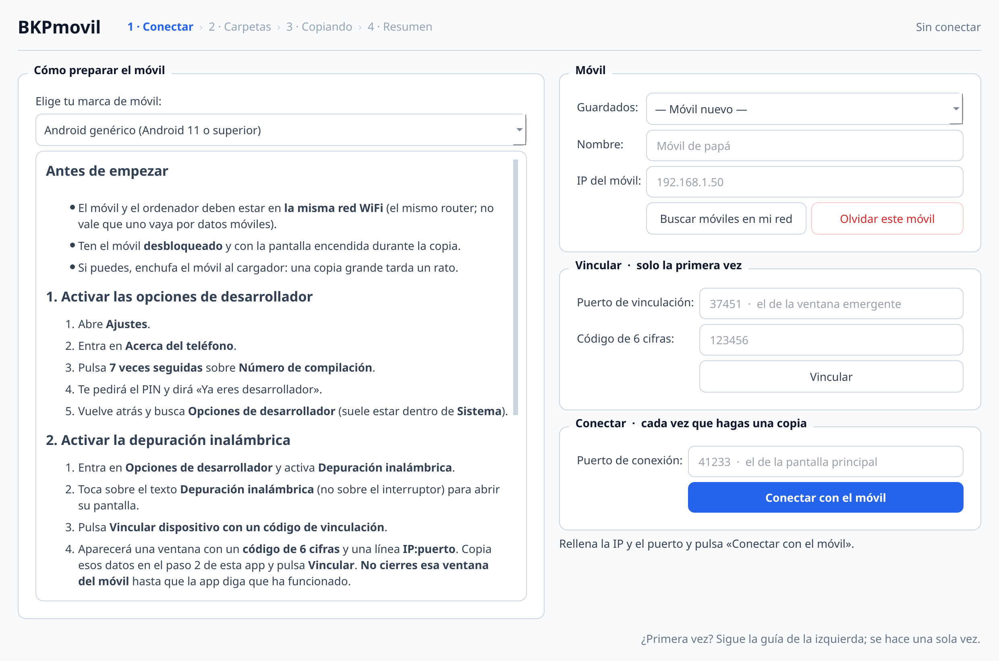
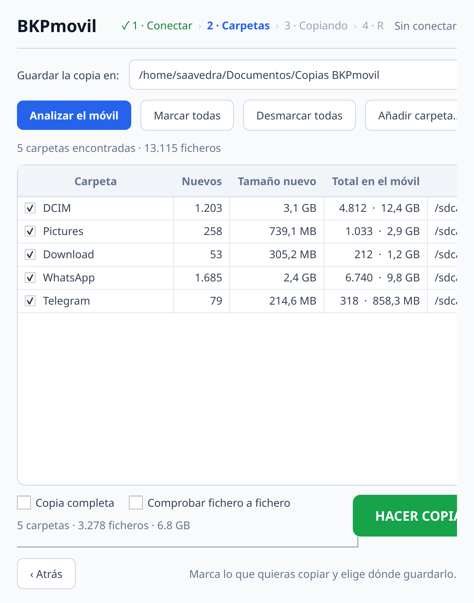
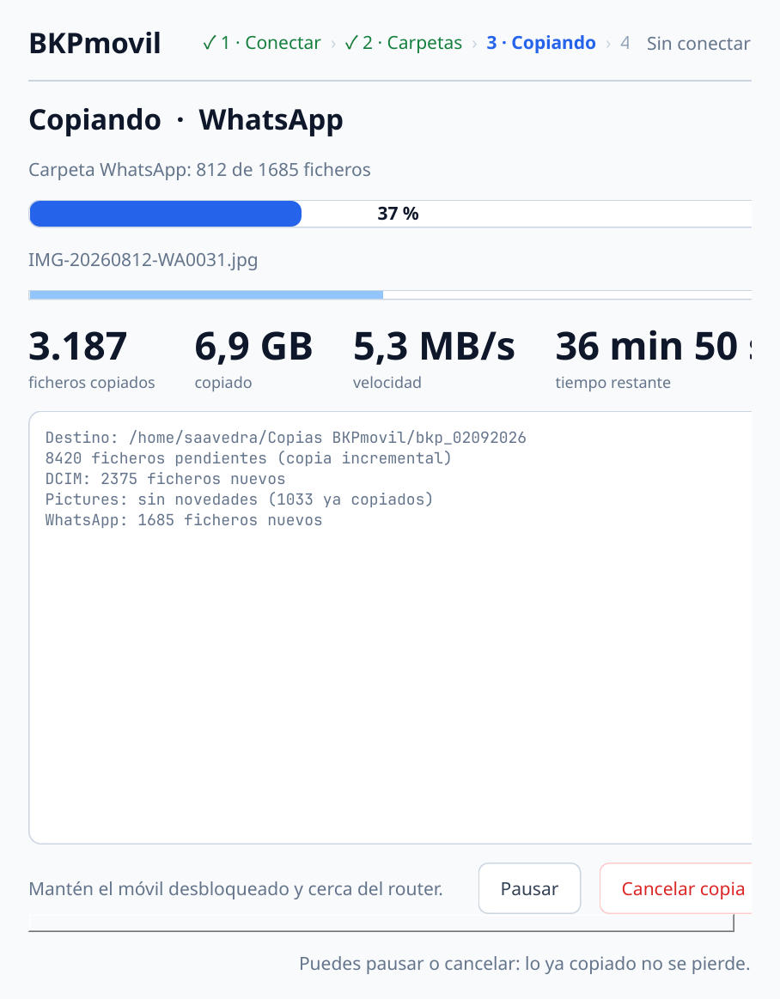
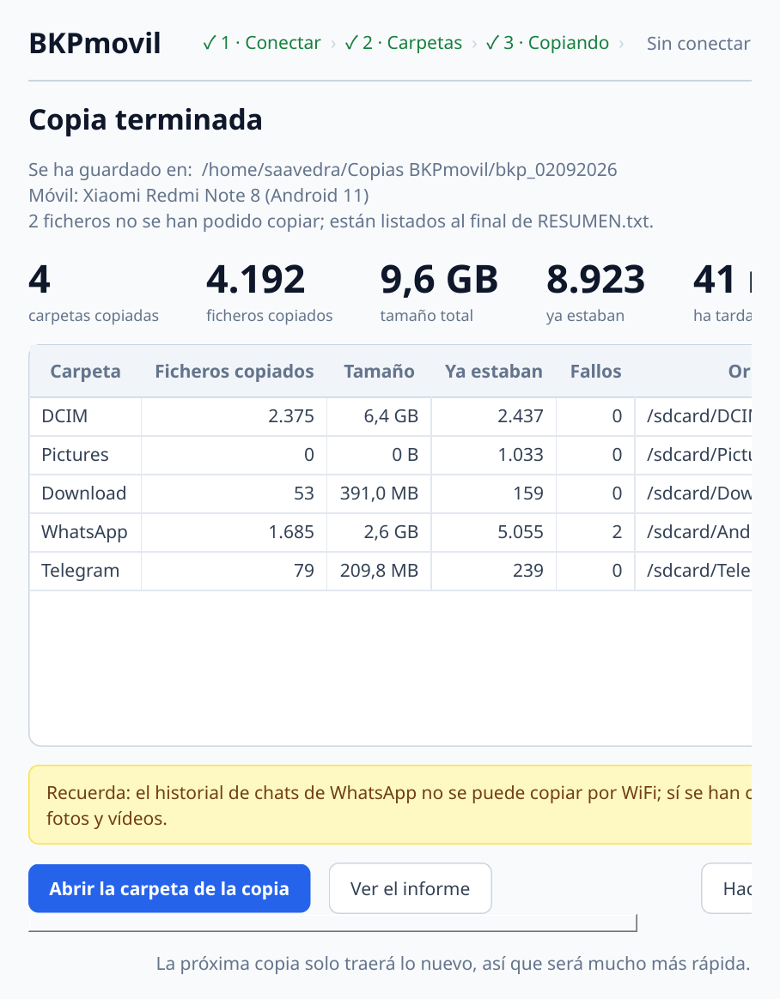

# Guía de BKPmovil

Manual completo. Si solo quieres empezar, con los pasos 1 a 4 tienes de sobra.

---

## 1. Instalar la aplicación en el ordenador

Descarga la última versión desde la
[página de versiones](https://github.com/fergballes/BKPmovil/releases/latest).

### Windows

Descarga `BKPmovil-X.Y.Z-instalador.exe`, ábrelo y sigue el asistente. Deja
marcada la casilla **«Crear un acceso directo en el Escritorio»**.

Windows mostrará un aviso azul diciendo que el programa no está firmado
(«Windows protegió su PC»). Es normal: firmar cuesta dinero y esta app es
casera. Pulsa **Más información** → **Ejecutar de todas formas**.

Si prefieres no instalar nada, descarga el `.zip`, descomprímelo donde
quieras y ejecuta `BKPmovil.exe`. Para tenerlo a mano: botón derecho sobre
`BKPmovil.exe` → *Enviar a* → *Escritorio (crear acceso directo)*.

### Linux

```bash
tar xzf BKPmovil-X.Y.Z-linux-x86_64.tar.gz
cd BKPmovil
./instalar.sh
```

Queda en el menú de aplicaciones y con un acceso directo en el Escritorio.
También puedes ejecutar `./BKPmovil` sin instalar nada.

Ambos paquetes llevan `adb` dentro, así que no hace falta instalar el SDK de
Android ni nada parecido.

---

## 2. Preparar el móvil

Esto hay que hacerlo **una sola vez por móvil**. La propia aplicación te lo
va enseñando paso a paso; elige tu marca en la lista desplegable.

### Activar las opciones de desarrollador

| Marca | Camino |
|---|---|
| **Samsung** (One UI) | Ajustes → Acerca del teléfono → Información del software → pulsar **7 veces** en *Número de compilación* |
| **Google Pixel** | Ajustes → Información del teléfono → pulsar **7 veces** en *Número de compilación* |
| **Xiaomi · Redmi · POCO** | Ajustes → Sobre el teléfono → pulsar **7 veces** en *Versión de HyperOS* (o *Versión de MIUI*) |
| **Huawei · Honor** | Ajustes → Acerca del teléfono → pulsar **7 veces** en *Número de compilación* |
| **OPPO · realme · OnePlus** | Ajustes → Acerca del dispositivo → Versión → pulsar **7 veces** en *Número de compilación* |
| **Otros** | Ajustes → Acerca del teléfono → pulsar **7 veces** en *Número de compilación* |

Después, el menú de *Opciones de desarrollador* aparece en:

- Samsung y Xiaomi: al final de Ajustes (Xiaomi, dentro de *Ajustes adicionales*).
- Pixel y la mayoría: Ajustes → *Sistema* → *Opciones para desarrolladores*.
- Huawei: Ajustes → *Sistema y actualizaciones*.

> **Xiaomi**: a veces pide iniciar sesión con la cuenta Mi y tener una SIM
> puesta antes de dejarte activar la depuración. Es un requisito del móvil.

### Activar la depuración inalámbrica

1. Dentro de *Opciones de desarrollador*, activa **Depuración inalámbrica**.
2. Toca sobre **el texto** «Depuración inalámbrica» (no sobre el interruptor)
   para entrar en su pantalla.

---

## 3. Conectar



Aquí está el punto donde se atasca todo el mundo, así que con calma:
**hay dos puertos distintos**.

### La primera vez: vincular

1. En el móvil, pulsa **Vincular dispositivo con un código de vinculación**.
2. Se abre una ventanita con un **código de 6 cifras** y una línea
   `192.168.1.50:37451`.
3. En BKPmovil, escribe esa IP, ese **puerto de vinculación** y el código, y
   pulsa **Vincular**.
4. **No cierres la ventana del móvil** hasta que la app diga que ha ido bien:
   ese código y ese puerto caducan al cerrarla.

### Siempre: conectar

5. Vuelve a la pantalla principal de *Depuración inalámbrica*. Arriba verás
   otra línea `192.168.1.50:41233`. **Ese puerto es distinto** del anterior.
6. Escríbelo en BKPmovil y pulsa **Conectar con el móvil**.

Ese segundo puerto **cambia** cada vez que reinicias el móvil o el WiFi, así
que en cada copia conviene mirarlo. La vinculación, en cambio, se queda
guardada para siempre.

El botón **Buscar móviles en mi red** intenta rellenarlo solo. Funciona si
tienes abierta en el móvil la pantalla de *Depuración inalámbrica*; si no lo
encuentra, no pasa nada: se escribe a mano.

### Android 10 o anterior

No existe la vinculación con código. Elige esa opción en la lista de marcas,
conecta el móvil **por cable USB**, acepta en el móvil el aviso *«¿Permitir
depuración USB?»* y pulsa **Activar por cable**. A partir de ahí ya puedes
quitar el cable y conectar por WiFi al puerto 5555. Este modo se pierde al
reiniciar el móvil.

---

## 4. Elegir qué copiar y dónde



Al conectar, la aplicación analiza el móvil sola. Verás una tabla con lo que
ha encontrado, cuántos ficheros hay y cuántos son nuevos desde la última vez.

- **Guardar la copia en**: pulsa *Examinar…* y elige la carpeta del
  ordenador. Se recuerda para la próxima vez. La app crea dentro una carpeta
  con la fecha, y si no existe la ruta, la crea.
- **Marca o desmarca** carpetas con las casillas. Tu elección se recuerda.
- **Añadir carpeta…** deja meter cualquier ruta del móvil que no se haya
  detectado, indicando si quieres todo o solo fotos y vídeos.
- **Copia completa** vuelve a traer también lo ya copiado. Normalmente no
  hace falta.
- **Comprobar fichero a fichero** verifica el contenido con sha1. Es más
  seguro y bastante más lento.

### Qué se detecta solo

Cámara (`DCIM`), imágenes, vídeos, descargas, documentos, capturas,
grabaciones, música y ficheros recibidos por Bluetooth.

Además, **busca por todo el móvil** las carpetas de WhatsApp, Telegram y
Signal —estén donde estén, que cambia según la versión de Android— y de ellas
copia **solo las fotos y los vídeos**. Son precisamente los que no aparecen en
la carpeta de la cámara.

### Qué NO se puede copiar

Sin «rootear» el móvil, Android bloquea `/sdcard/Android/data`. Eso significa
que **el historial de chats de WhatsApp no se puede copiar** con esta ni con
ninguna herramienta parecida. Para los chats, usa la copia de seguridad del
propio WhatsApp o la opción *Exportar chat*.

Tampoco se copian contactos, SMS, registro de llamadas ni los datos internos
del resto de aplicaciones.

---

## 5. La copia



Verás en todo momento la carpeta que se está copiando, el fichero concreto,
cuántos ficheros llevas, la velocidad y el tiempo que queda.

- **Pausar** detiene la copia sin perder nada.
- **Cancelar** la interrumpe: todo lo copiado hasta ese momento queda
  guardado y registrado, así que la próxima vez sigue donde lo dejaste.
- Si se corta el WiFi, reintenta cada fichero tres veces e intenta
  reconectar con el móvil por su cuenta.

Deja el móvil **desbloqueado** y, si la copia es grande, enchufado.

---

## 6. El resumen



Al terminar se muestran las carpetas copiadas, el número total de ficheros,
el tamaño, cuántos ya estaban de copias anteriores y cuánto ha tardado.

Dentro de la carpeta de la copia quedan dos ficheros:

- **`RESUMEN.txt`** — el mismo informe en texto, con la lista de errores si
  los hubo.
- **`manifiesto.json`** — los mismos datos en formato legible por programas.

---

## 7. Cómo queda organizado en el ordenador

```
Copias BKPmovil/
├── bkp_02092026/                 ← primera copia: todo
│   ├── DCIM/Camera/…
│   ├── Pictures/…
│   ├── Download/…
│   ├── WhatsApp/Media/WhatsApp Images/…
│   ├── Telegram/…
│   ├── RESUMEN.txt
│   └── manifiesto.json
└── bkp_19092026/                 ← segunda copia: solo lo nuevo
    ├── DCIM/Camera/IMG_9981.jpg
    ├── RESUMEN.txt
    └── manifiesto.json
```

La estructura de carpetas del móvil se respeta tal cual, así que puedes
navegarla sin la aplicación. Si un nombre de fichero tiene caracteres que
Windows no admite (`: ? * " < > |`), se sustituyen por `_` y queda anotado en
el manifiesto.

---

## 8. Cómo funciona la copia incremental

La aplicación guarda un índice de lo ya copiado en:

- Windows: `%APPDATA%\BKPmovil\index\`
- Linux: `~/.config/bkpmovil/index/`

Un fichero se considera ya copiado si coinciden **ruta, tamaño y fecha de
modificación**. Si lo editas o lo cambias, se vuelve a copiar.

Si pierdes ese índice (ordenador nuevo, borrado por error), **no tienes que
volver a copiarlo todo**: reconstrúyelo a partir de las copias que ya tengas
en disco con

```bash
bkpmovil rebuild-index --dest "/ruta/a/Copias BKPmovil"
```

---

## 9. Si algo va mal

| Qué ves | Qué pasa |
|---|---|
| «No se ha podido conectar con el móvil para emparejar» | El móvil y el ordenador no están en la misma red WiFi, o has cerrado la ventana de vinculación, o has usado el puerto equivocado. |
| Vincula bien pero no conecta | Estás usando el puerto de la ventana de vinculación en vez del de la pantalla principal. Son distintos. |
| Conectaba y ha dejado de conectar | El puerto cambió al reiniciar el móvil o el WiFi. Míralo otra vez en el móvil. |
| «No se encuentra el almacenamiento del móvil» | El móvil está bloqueado, o hay un aviso pendiente de aceptar en su pantalla. |
| La opción de depuración inalámbrica está en gris (Xiaomi) | Inicia sesión con la cuenta Mi y activa también *Depuración USB*. |
| La copia va muy lenta | Es WiFi. Acerca el móvil al router; si puedes, usa la red de 5 GHz. |
| Faltan las fotos de WhatsApp | Comprueba que la fila «WhatsApp» estaba marcada en el paso 2. |
| No aparecen los chats de WhatsApp | No es un fallo: Android no deja copiarlos. Ver el apartado 4. |

---

## 10. Uso desde la terminal

Todo lo que hace la ventana se puede hacer sin ella:

```bash
bkpmovil devices                                          # ver móviles conectados
bkpmovil pair    --host 192.168.1.50 --port 37451 --code 123456
bkpmovil connect --host 192.168.1.50 --port 41233
bkpmovil list    --host 192.168.1.50 --port 41233          # qué carpetas hay
bkpmovil backup  --host 192.168.1.50 --port 41233 \
                 --dest "~/Copias BKPmovil" --open
bkpmovil backup  --only DCIM WhatsApp                      # solo algunas
bkpmovil backup  --full                                    # sin incremental
bkpmovil rebuild-index --dest "~/Copias BKPmovil"
```

Es lo cómodo para programar copias automáticas con `cron` o el Programador
de tareas de Windows.
